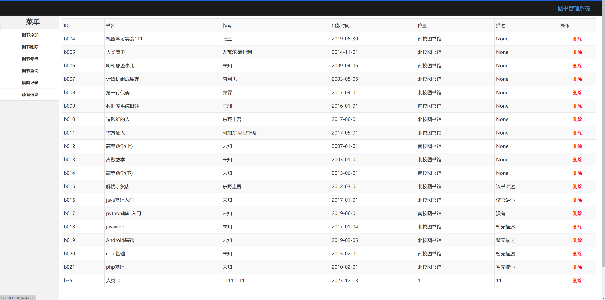
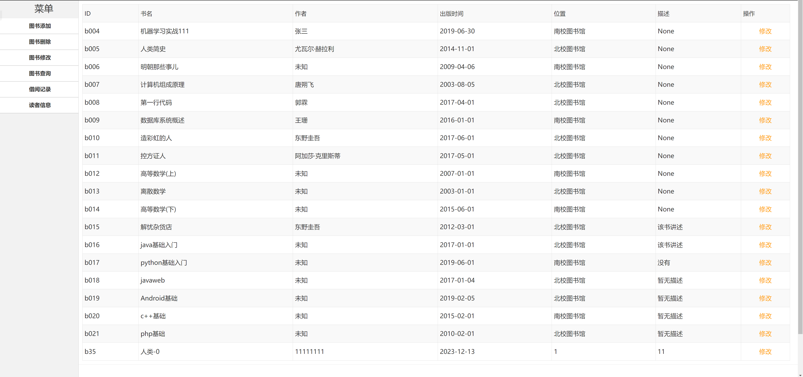
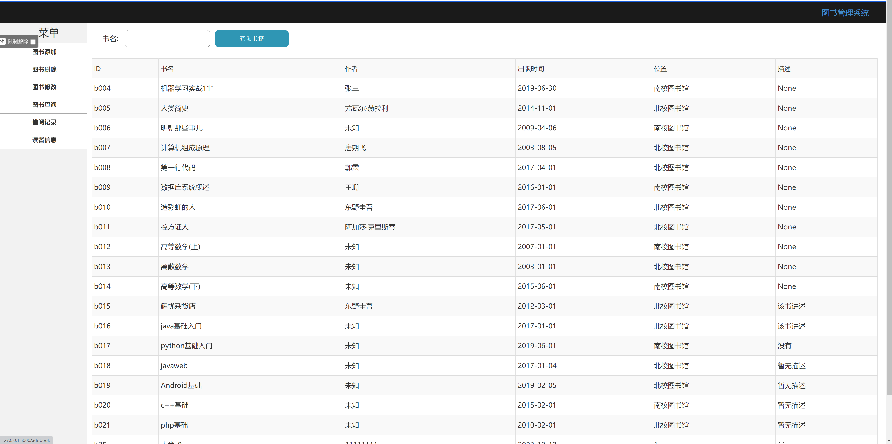
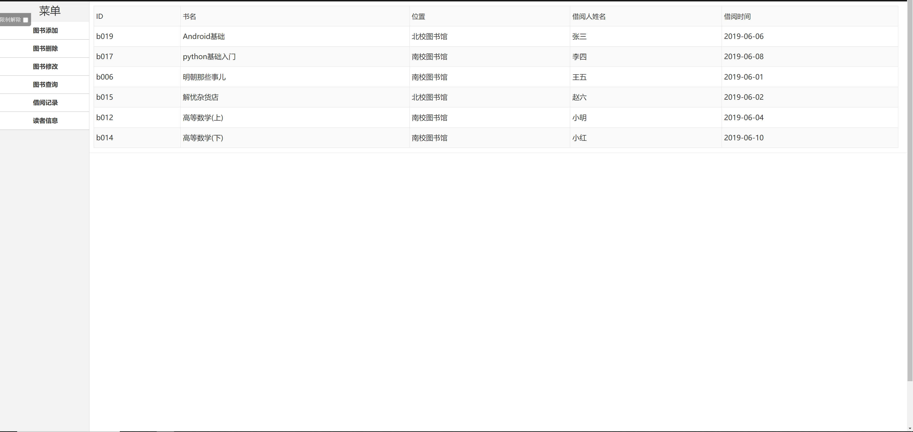
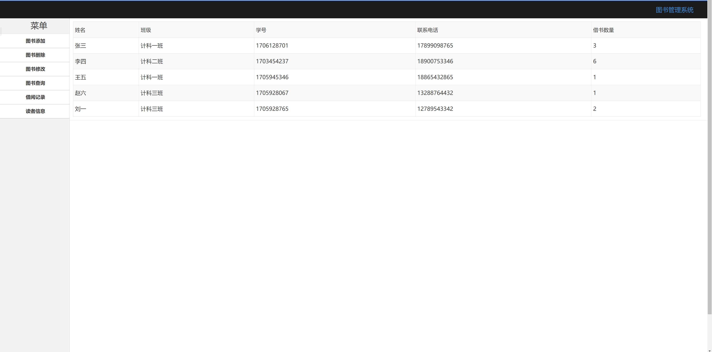

### **Chapter I：Front-end design**

 

Table 1 Login interface

 

Table 2 Registration interface

 

Table 3 Add books

 

Table 4 Delete Books

 

Table 5 Modify Books

 

 

Table 6 Find Books

 

Table 7 Borrowing records

 

Table 8 Reader information

### **Chapter 2: Database Design**

#### **4.1 **Design of data table and input of some initial data

Table 1 book information table

| Field name      | Data type  | Default value | Length | Description                 |
| --------------- | ---------- | ------------- | ------ | --------------------------- |
| ID              | Int        | None          | 4      | DataId value                |
| Name | Varchar | None | 20 | Book Title |
| Number | Varchar | None | 8 | Book serial number |
| Author | Varchar | None | 10 | Author |
| Publicationdate | Date | None | 10 | Publication date |
| Isborrow | Int | None | 1 | Borrowing status (1: Borrowed, 0: Not borrowed) |
| Remark | Varchar | None | 50 | Book Introduction |
| Location | Varchar | None | 20 | Book Locations |
| Borrowname | Varchar | None | 20 | Borrower name |
| Borrowtime | Date | None | 10 | Borrowing time |

Table 2 student reader information table

| Field name   | Data type | Default value | Length | Description |
| ------------ | --------- | ------------- | ------ | -------- |
| ID | Int | None | 4 | DataId value |
| Name | Varchar | None | 10 | Reader Name |
| Psw | Varchar | None | 10 | Password |
| Class | Varchar | None | 10 | Class |
| Learnnumber | Varchar | None | 20 | Student number |
| Phonenumber | Varchar | None | 20 | Phone number |
| Borrownumber | Varchar | None | 20 | Number of books borrowed |

 

Table 3 user librarian information table

| Field name | Data type | Default value | Length | Description |
| -------- | -------- | ------ | ---- | ---------- |
| ID | Int | None | 4 | DataId value |
| Name | Varchar | None | 10 | Administrator Name |
| Psw | Varchar | None | 10 | Password |

 

Table 4 record end record information table

| Field name | Data type | Default value | Length | Description |
| ---------- | -------- | ------ | ---- | ------------ |
| ID | Int | None | 4 | DataId value |
| Readername | Varchar | None | 10 | Administrator Name |
| Booknumber | Varchar | None | 10 | Password |
| Borrowdate | Date | None | 10 | Borrowing time |
| Returndate | Date | None | 10 | Book return time |
| Remark | Varchar | None | 10 | Record remark information |

 

### **Chapter 3: Summary**

CURD of this library project is fully implemented, and the front-end uses fetch to request the REST-API service interface, perform additions, deletions, modifications, and queries, and connects to GCP-Mysql for data storage.
